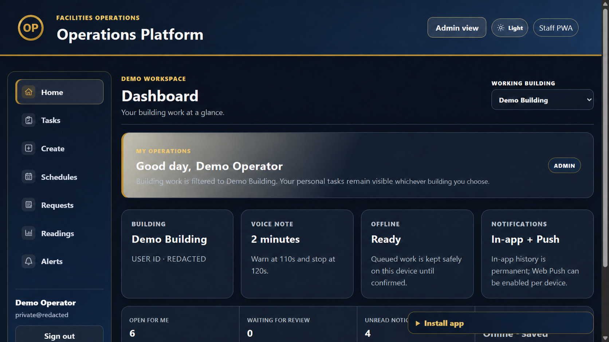
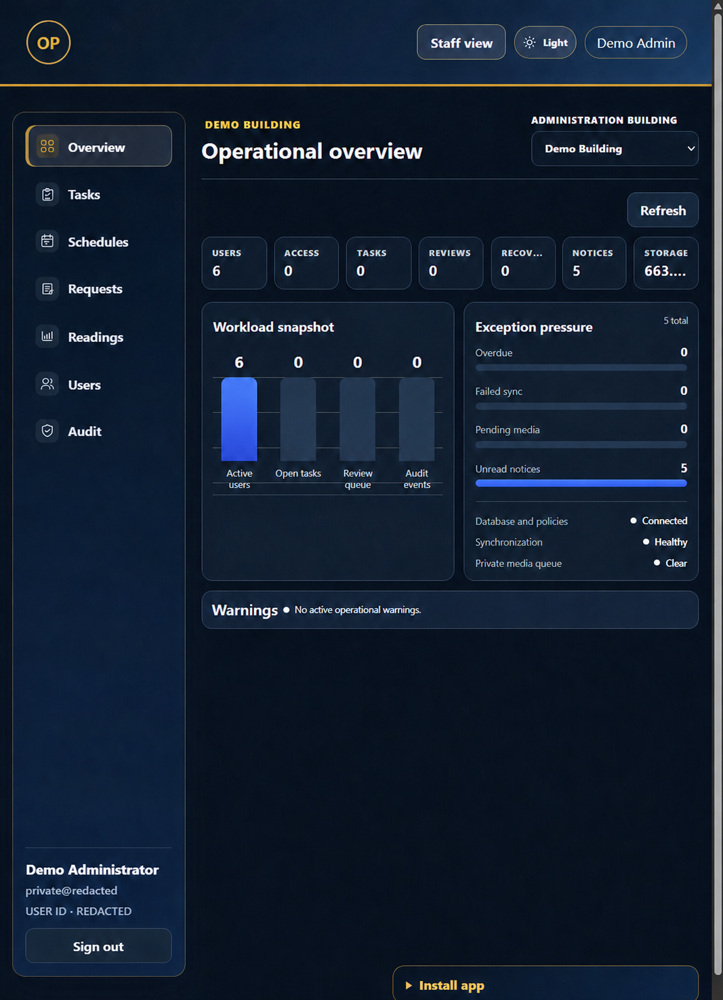

# Facilities Operations Platform

[Fact] Documented methods and tools: React, TypeScript

[Back to project index](README.md) · [Portfolio section](https://gabreo10.github.io/portfolio/#flagship)

[Fact] The project connected a staff application and management dashboard for tasks, schedules, requests, meter readings, approvals, alerts and work history.

[Fact] The portfolio documented role-based access, workflows that recovered after weak connections, and traceable management reviews. The delivery plan covered workflow testing, backups, staff testing, support and recovery.

[Fact] This public case study includes sanitized staff and administration views. The employer application source, credentials, operational records and deployment configuration are excluded.

