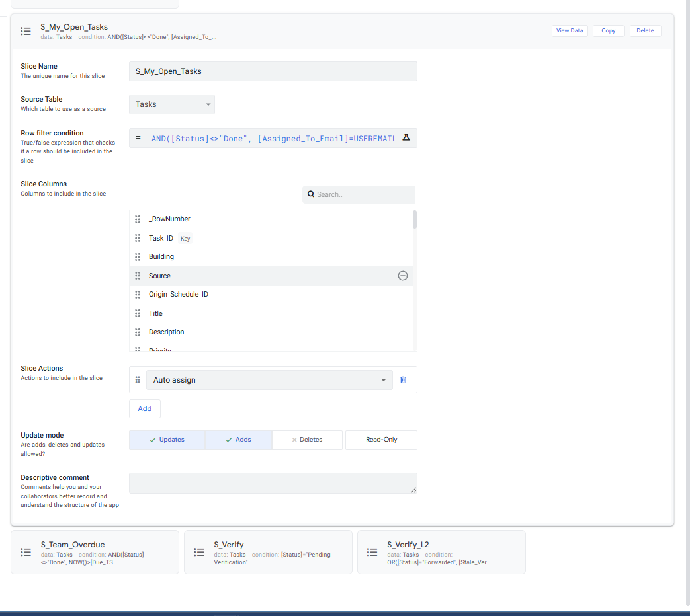
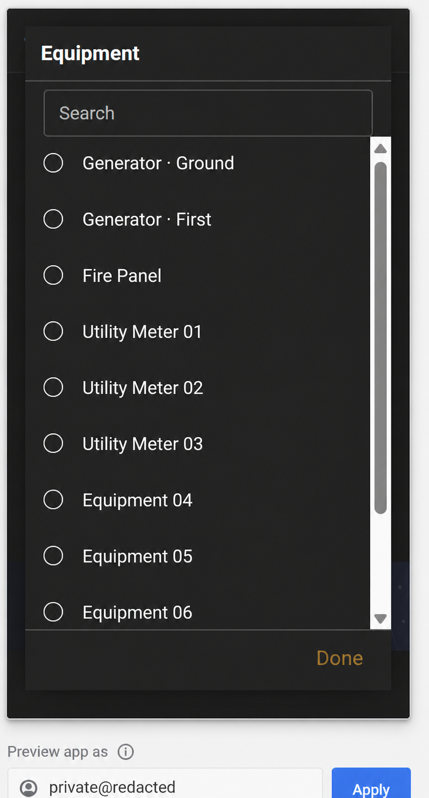

# AppSheet Operations System

[Fact] Documented methods and tools: AppSheet, workflow automation

[Back to project index](README.md) · [Portfolio section](https://gabreo10.github.io/portfolio/#appsheet)

[Fact] The project supported work assignment, approvals, readings, work history, scheduled tasks, reminders and notifications. Staff and managers had different views.

[Fact] The portfolio documented 10 connected tables and an 80-page setup and handover manual. The manual covered information setup, access levels, daily workflows, testing, troubleshooting and recovery.

[Fact] The public release contains selected sanitized configuration and mobile views. The application export, production tables, access configuration and full internal manual are excluded.

