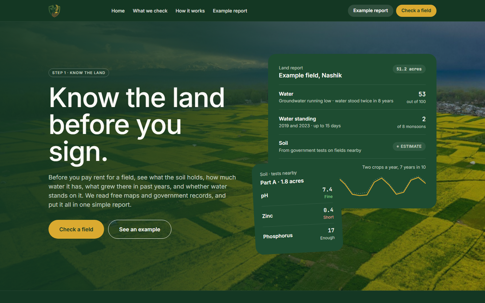
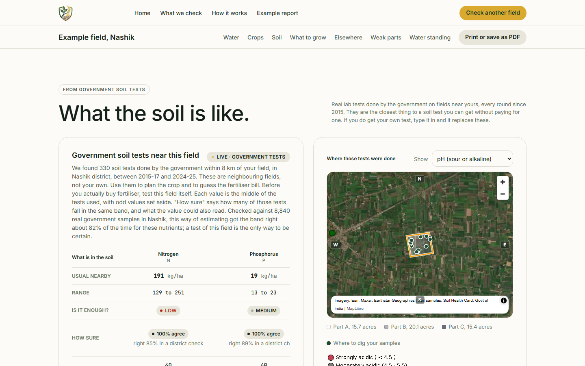

# Land Project

[Fact] Documented methods and tools: Maps, satellite history, soil and weather data

[Back to project index](README.md) · [Portfolio section](https://gabreo10.github.io/portfolio/#land)

[Fact] Built with a project partner, the tool produced a plain-language report for a field drawn on a map before a prospective lease. Partner and private organization details are withheld.

[Fact] The documented report combined government soil tests near the field, daily weather history, satellite history and nearby water features. Soil tests from neighboring fields were identified as nearby evidence rather than a test of the selected field itself.

[Fact] The portfolio documented a catalog of 180 Indian crops, 35 years of daily weather, five crop-evidence gates and a registry of 23 data sources. A registered source did not imply that every report used it.

[Fact] Crop screening used deterministic verdicts: clear fit, conditional fit, not assessable or not suitable. Values were labeled tested, estimate or not checked; AI explained completed verdicts.

[Fact] These screenshots show the project's example field. This release includes a case study and selected views; private source, actual field boundaries and operational records are excluded.

