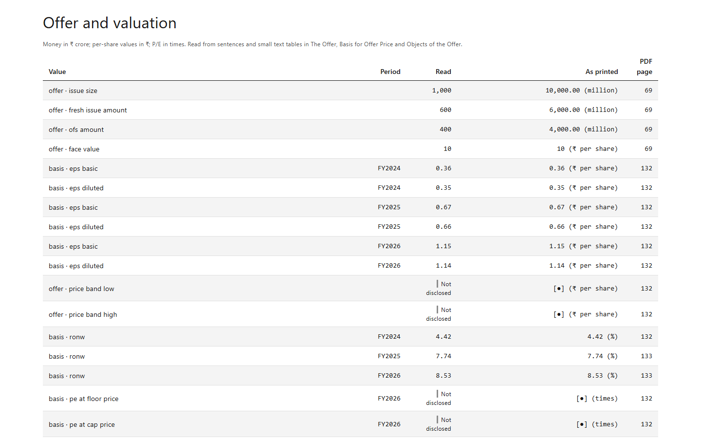

# IPO Dossier

[Fact] Documented methods and tools: Python, PDF prospectus extraction, source-page citations

[Back to project index](README.md) · [Portfolio section](https://gabreo10.github.io/portfolio/#ipo)

[Fact] Built with a project partner, this research tool read Indian IPO offer documents and attached prospectus-page references to extracted facts. Partner and private organization details are withheld.

[Fact] The reader mapped document sections to PDF pages and extracted offer terms, restated statements and valuation inputs. When a model supplied a missing value, the project required a page and an exact quote, then checked that the page contained the quoted number before retaining it.

[Fact] The documented report combined filing evidence with subscription, anchor-investor and recent-listing context. It presented evidence and a decision brief rather than an investment recommendation.

[Fact] The selected image shows the reader's value, printed-value and page-reference columns. It is evidence of the output format, not a claim of universal extraction accuracy. Issuer names, named investor tables, source files, private code and configuration are excluded from this release.

