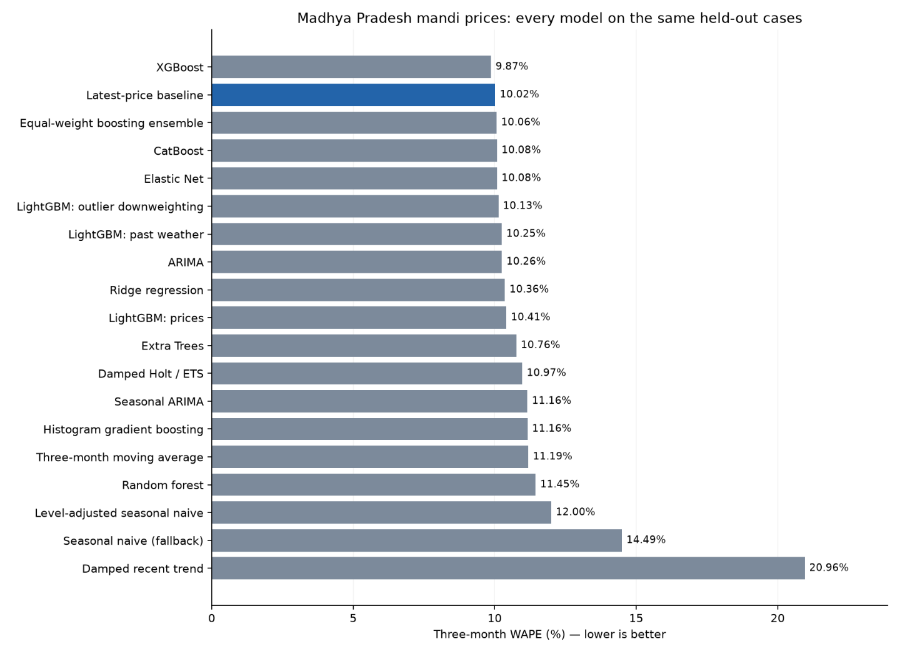
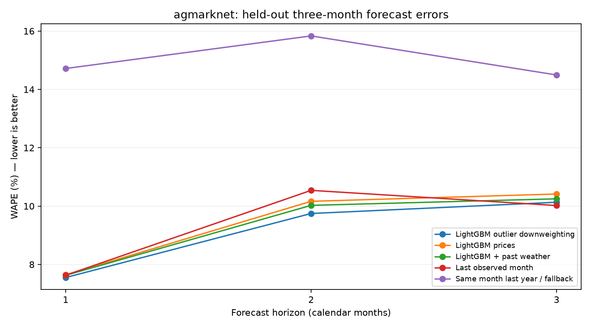
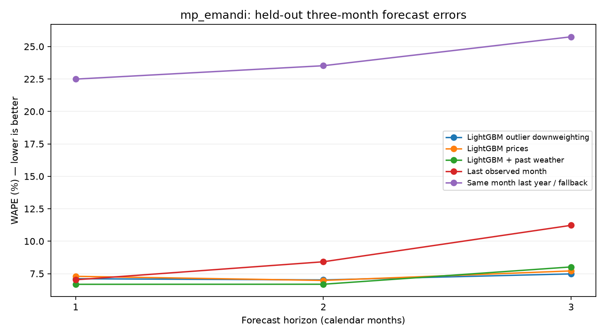

# Rice Paddy Price Prediction

[Fact] Documented methods and tools: Python, time-series backtesting, LightGBM and XGBoost

[Back to project index](README.md) · [Portfolio section](https://gabreo10.github.io/portfolio/#rice-paddy)

[Fact] Built with a project partner, the study evaluated Madhya Pradesh paddy-price forecasts for procurement research at one, two and three calendar months ahead. Partner and organization details are withheld.

[Fact] The project checked dates, missing values, price-order errors and conflicting reports, then formed monthly observed-price medians. AGMARKNET and MP e-Mandi results were kept separate. Features included price lags, rolling history, seasonality and market/variety identifiers; a separate experiment used lagged NASA POWER weather.

[Fact] The archived comparison evaluated 19 methods. Earlier validation periods selected the model, and later rolling origins measured historical test error against latest-price persistence and seasonal baselines.

[Fact] On the AGMARKNET three-month test, the validation-selected `lightgbm_weather` model recorded 10.249728945881706% WAPE, compared with 10.019647982647626% for `persistence`. The selected model had higher error on that comparison; the study did not establish dependable improvement. These were historical backtests, not issued live forecasts.

## Public results

[Fact] The following files preserve only percentage-error statistics and model/phase/horizon labels from the archived public-market-source results. Prices, volumes, price-unit MAE/RMSE, row-level observations and internal-source results are excluded.

- [AGMARKNET WAPE results](rice-paddy-agmarknet-wape.csv)
- [AGMARKNET baseline comparisons](rice-paddy-agmarknet-baselines.csv)
- [MP e-Mandi WAPE results](rice-paddy-emandi-wape.csv)
- [MP e-Mandi baseline comparisons](rice-paddy-emandi-baselines.csv)

[Fact] `phase` identifies validation or test. `horizon` 1, 2 and 3 means calendar months ahead; 0 pools those horizons. WAPE is weighted absolute percentage error; lower is better. Baseline deltas and bootstrap bounds are in percentage points. A negative delta means lower error than persistence. The MP e-Mandi test sample was sparse, so it did not support a broad performance claim.







## Reusable code subset

[Fact] [rice_paddy_fundamentals.py](rice_paddy_fundamentals.py) is the original contextual-feature module. It validates a caller-supplied evidence bundle and joins only reviewed evidence available by each forecast origin. It returns feature values separately from their provenance. The module was copied unchanged; the [original tests](test_rice_paddy_fundamentals.py) changed only their import to match the flat filename.

[Fact] This subset does not train a forecasting model or reproduce the archived model comparison. Private bundles, generated provenance, collectors, fitted models, the dashboard and full pipeline are excluded. The tests use constructed fixtures and placeholder URLs; their numbers are test inputs rather than observed commercial prices or volumes.

Use Python 3.11 or later. From this `projects` directory:

```sh
python -m pip install -r rice-paddy-requirements.txt
python -m unittest discover -s . -p test_rice_paddy_fundamentals.py -v
```

```python
from rice_paddy_fundamentals import build_features, validate_bundle

# Supply your own reviewed bundle and a pandas DataFrame with
# origin and target_month columns. Keep private evidence local.
validate_bundle(bundle)
features, provenance = build_features(examples, bundle)
```
